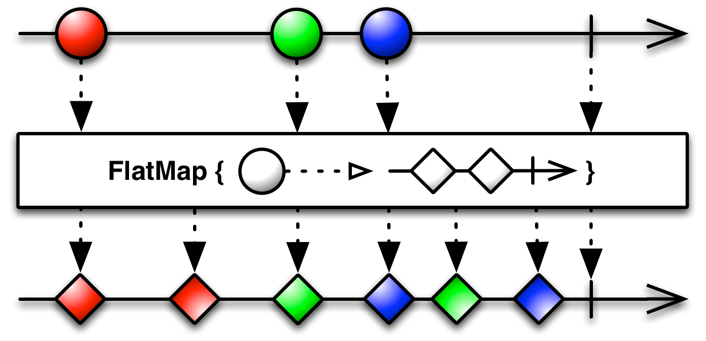
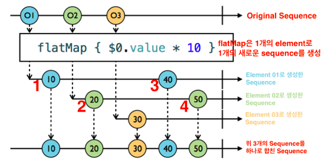

## FlatMap

- Flatmap은 각 하나의 sequence에서 각 event에 대해 sequence를 만든 후, 최종적으로 하나의 sequence로 만듭니다.


<div align="center"></div>

<div align="center"></div>

- 원본 Observable이 항목을 방출하면, flatMap 연산자가 변환 함수를 실행합니다. 변환 함수는 방출된 항목을 Observable로 변환합니다.
- 방출된 항목의 값이 바뀌면, flatMap 연산자가 변환한 Observable이 새로운 항목을 방출합니다. 그래서 원본 Observable이 방출한 항목을 지속적으로 감시하고, 최신 값을 확인할 수 있습니다. 
- flatMap은 그렇게 방출된 Observable들을 모아서 하나의 Observable로 만들어 리턴합니다. 즉 개별 항목이 개별 Observable로 변환되었다가, 다시 하나의 Observable로 합치는 작업을 합니다. 

<br/>

### 예제1

```swift
let sequenceInt = Observable.of(1, 2, 3)	// Int 타입 시퀀스
let sequenceString = Observable.of("A", "B", "C", "D")	// String 타입 시퀀스

sequenceInt
	.flatMap { (x: Int) -> Observable<String> in // 새로운 observable 을 만듦
		print("Emit Int Item : \(x)")
		return sequenceString
	}
	.subscribeNext { // 발행한 아이템을 구독하고 출력
		print("Emit String Item : \($0)")
}
```

```
Emit Int Item : 1
Emit String Item : A
Emit String Item : B
Emit String Item : C
Emit String Item : D
Emit Int Item : 2
Emit String Item : A
Emit String Item : B
Emit String Item : C
Emit String Item : D
Emit Int Item : 3
Emit String Item : A
Emit String Item : B
Emit String Item : C
Emit String Item : D
```

<br/>

### 예제2

```swift
let disposeBag = DisposeBag()

struct Student {
    var score: BehaviorRelay<Int>
}

let john = Student(score: BehaviorRelay(value: 75))
let mary = Student(score: BehaviorRelay(value: 95))

let student = PublishSubject<Student>()

student.asObservable()
    .flatMap { $0.score.asObservable() }
    .subscribe(onNext: {
        print($0)
    }).disposed(by: disposeBag)

student.onNext(john)
john.score.accept(100)

student.onNext(mary)
mary.score.accept(80)
john.score.accept(40)
```

```
75
100
95
80
40
```

<br/>

### 예제3

```swift
let disposeBag = DisposeBag() 
let a = BehaviorSubject<Int>(value: 1) 
let b = BehaviorSubject<Int>(value: 2) 
let subject = PublishSubject<BehaviorSubject<Int>>() 

subject 
	.flatMap { $0.asObservable() } // Subject -> Observable로 변환하는 메소드 
	.subscribe { print($0) } 
	.disposed(by: disposeBag) 

subject.onNext(a) 
subject.onNext(b) 

a.onNext(11) 
b.onNext(22)
```

```
next(1) 
next(2) 
next(11) 
next(22)
```


> 예제랑 공식문서 봐도 잘 이해 안 간다 ㅠㅠ 다시 볼것~~
