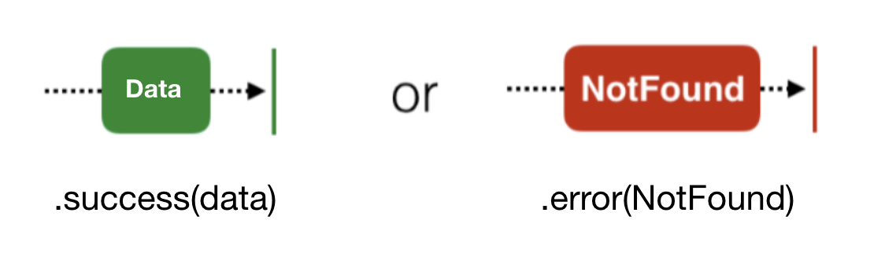
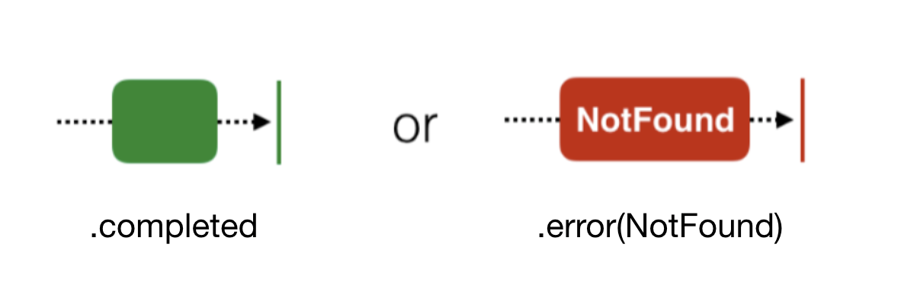
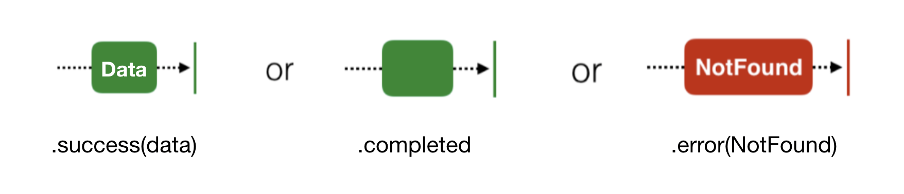

# RxSwift Observable Traits


## 1. Single

- 항상 단일 요소나 오류를 방출할 것을 보장합니다.
- Common Usage: DB Fetch Operations, Network Requests

<div align="center"></div>

```swift
public let isUserValid: Bool = true
private let disposeBag = DisposeBag()
public enum KnownError: Error {
        case notValidUser
}

func getData() -> Single<[String:String]> {
        return Single.create(subscribe: { [weak self] (event) -> Disposable in
            guard let self = self else { return Disposables.create() }
            if self.isUserValid { // Some condition can be added
                event(.success(["name":"John Doe","designation":"iOS Developer"]))
            } else {
                event(.error(KnownError.notValidUser))
            }
            return Disposables.create {
                print("Disposed trait resources")
            }
        })
}

//Subscribe
let single = getData()
single.subscribe(onSuccess: { (value) in
       print("Value is \(value)")
}) { (err) in
       print("Error is \(err.localizedDescription)")
}.disposed(by: disposeBag)
```

```
Value is ["designation": "iOS Developer", "name": "John Doe"]
Disposed trait resources
```

<br/>

## 2. Completable

- `Completable`은 변화무쌍한 `Observable` 입니다.
-  `completed` 나, `error` 를 방출하고, 아무 요소도 방출하지 않는것을 보장합니다.
- `Completable`은 완료에 따른 요소에 신경 쓰지 않은 경우 사용하면 유용합니다. 요소를 내보낼 수 없는 경우 Observable를 사용하여 비교할 수 있습니다.
- Common Usage: Updating a Cache

<div align="center"></div>

```swift
private let disposeBag = DisposeBag()
public enum SomeError: Error {
   case genericError(String)
}

let completable = Completable.create { event in
        let someError = false
        if someError {
            event(.error(SomeError.genericError("Error occurred")))
        } else {
            event(.completed)
        }
        return Disposables.create {
            print("Disposed trait resources")
        }
}

//Subscribe
completable.subscribe(onCompleted: {
       print("Completed Event")
}) { (err) in
       print("Error is \(err.localizedDescription)")
}.disposed(by: disposeBag)
```

```
Completed Event
Disposed trait resources
```

<br/>

## 3. Maybe

- `Single`과 `Completable`사이에 있는 Observable의 변형입니다.
- `.success`, `.completed`, `.error` 를 방출합니다.
- 완료된 이벤트, 싱글이벤트 또는 오류를 방출합니다.
- Common Usage: Fetching Data from Cache

<div align="center"></div>

```swift
private let disposeBag = DisposeBag()
public enum SomeError: Error {
   case genericError(String)
}

let maybe = Maybe<String>.create { event in
    let dividend = Int.random(in: 20...30)
    let divisor = Int.random(in: 0...5)
        
    if divisor == 0 {
       event(.error(SomeError.genericError("Divisor is 0")))
    } else {
       let value = dividend / divisor
       if value > 5 {
          event(.success("Number is greater than 5"))
       } else {
          event(.completed)
       }
    }
    return Disposables.create {
        print("Disposed trait resources")
    }
}

//Subscribe
maybe.subscribe(onSuccess: { (value) in
      print("Value is \(value)")
}, onError: { (err) in
      print("Error is \(err.localizedDescription)")
}) {
      print("Completed Event")
}.disposed(by: disposeBag)
```

```
Value is Number is greater than 5
Disposed trait resources
```


> 참고 자료: https://medium.com/@priya_talreja/rxswift-traits-4408d66cb6ad

