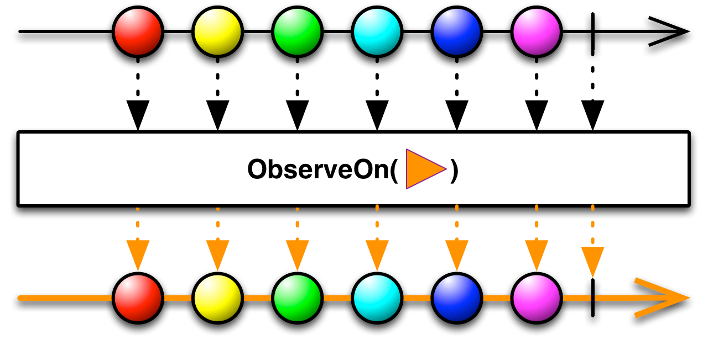

## Scheduler

멀티스레드를 사용하여 여러가지 작업을 Observable 연산자로 묶어 수행하는 경우가 있습니다. (가령 백그라운드 스레드에서는 네트워크 작업, 많은 연산이 필요한 작업을 해야하고, 화면에 보여주기 위해서는 메인 스레드에서 작업을 해야합니다.) 이 작업들은 Observable 연산자로 묶어  각각의 작업에 맞게 스레드 지정을 해야합니다.

Scheduler 는 이러한 특정 작업을 실행하는 스레드를 가르키는 말입니다.

`observeOn` 과 `subscribeOn` 은 scheduler 로 작동되는 대표적인 두 연산자 입니다.

<br/>

## observeOn

<div align="center"></div>

- observeOn 은 sequence를 어느 스케줄러에서 observe 할 것인지 결정합니다. 
- 각각의 operator 를 다른 스케줄러에서 지정하고 싶을 때 사용합니다.
- Event flow 의 스케줄러를 변경합니다. (downstream 으로 영향을 줍니다.)

```swift
sequence1
  .observeOn(backgroundScheduler)
  .map { n in // backgroundScheduler 에서 동작
      print("This is performed on the background scheduler")
  }
  .observeOn(MainScheduler.instance)
  .map { n in // MainScheduler 에서 동작
      print("This is performed on the main scheduler")
  }
```

<br/>

## subscribeOn

<div align="center"></div>

- subscribeOn 은 sequence 가 시작할 때 (`subscribe()` 가 호출될 때 ) 스케줄러를 결정합니다. 
- 특정 스케줄러에서 동작의 수행을 보장할 때 한 번만 실행하는 것을 권장합니다. 
- Subscribe flow 의 스케줄러를 변경합니다. (Upstream, downstream 으로 영향을 줍니다.)

```swift
Observable.of(...) // scheduler 2
    .filter { ... } // scheduler 2
    .observeOn(scheduler1) // scheduler 2
    .map { ... } // scheduler 1
    .subscribeOn(scheduler2) // scheduler 1
     ... //각종 연산들, scheduler 1
    .subscribe { // scheduler 1
        ...
    }.disposed(by:bag)
```

<br/>

### 정리 (observeOn, subscribeOn)

<div align="center"></div>
