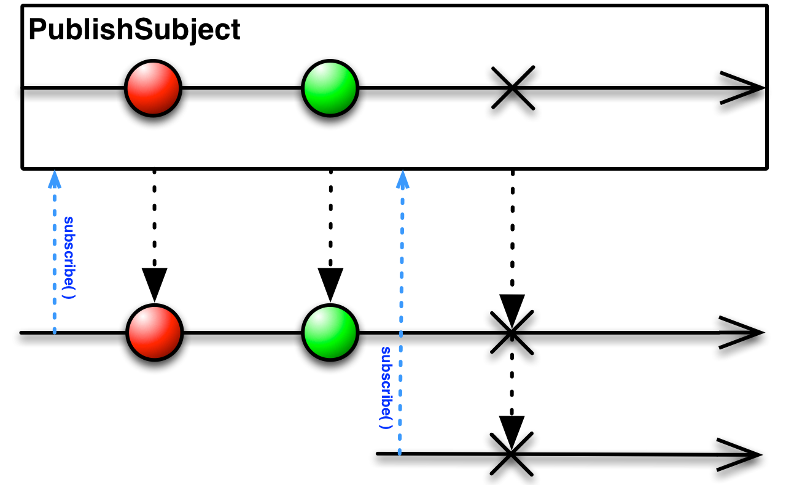
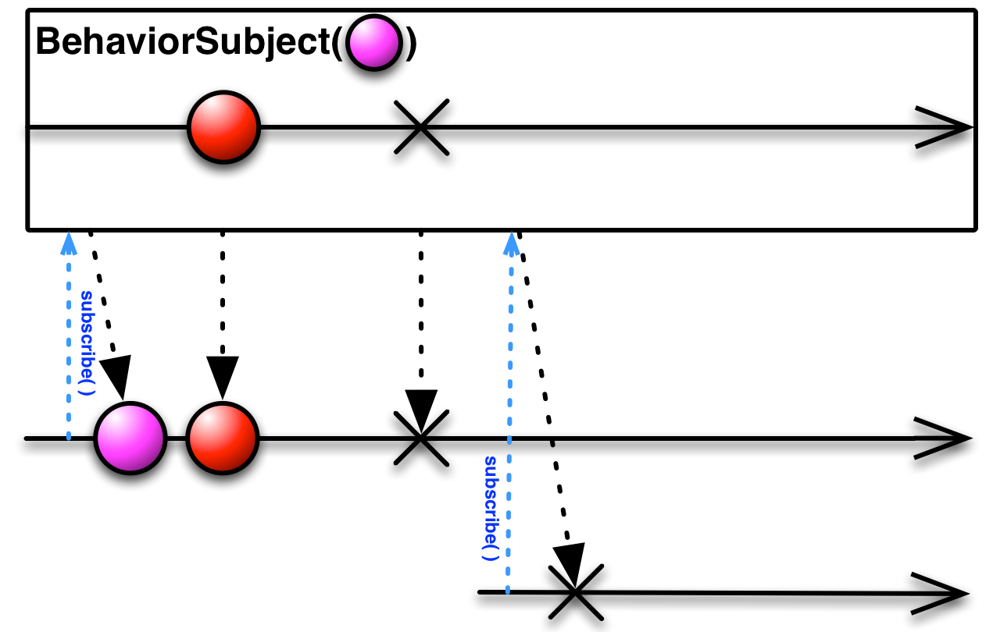

## Subject

- `Observable` 이자 `Observer` 인 역할을 합니다.
- 실시간으로 `Observable` 에 값을 추가하고 `Subscribe` 할 수 있습니다.
- `Observer` 역할로 하나 이상의 `Observable`을 구독하며, `Observable` 역할로 아이템을 내보낼 수 있습니다.

<br/>

## 1. PublishSubject

PublishSubject는 `.completed`, `.error` 이벤트가 발생할 때까지 (종료될 때까지) **subscribe한 이후**부터 이벤트를 방출합니다.

<div align="center"></div>


```swift
let subject = PublishSubject<Int>()

let subjectOne = subject
    .subscribe(onNext: { (num) in
        print("subjectOne :",num)
    })

subject.onNext(1)
subject.onNext(2)

let subjectTwo = subject
    .subscribe(onNext: { (num) in
        print("subjectTwo :", num)
    })

subject.onNext(3)
subject.onNext(4)
subject.onNext(5)

```

```
 subjectOne : 1
 subjectOne : 2
 subjectOne : 3
 subjectTwo : 3
 subjectOne : 4
 subjectTwo : 4
 subjectOne : 5
 subjectTwo : 5
```

<br/>

## 2. BehaviorSubject

`BehaviorSubject`는  **초기값** 을 가집니다. `PublishSubject` 와 달리 항상 **직전의 값부터 구독** 합니다. 

<div align="center"></div>

```swift
let subject = BehaviorSubject(value: 5)

let subjectOne = subject
    .subscribe(onNext: { (num) in
        print("subjectOne :",num)
    }, onError: { (error) in
        print("subjectOne Erorr: ",error)
    }, onCompleted: {
        print("subjectOne onCompleted")
    })

subject.onNext(6)
subject.onNext(7)
subject.onNext(8)

let subjectTwo = subject
    .subscribe(onNext: { (num) in
        print("subjectTwo :",num)
    }, onError: { (error) in
        print("subjectTwo Erorr: ",error)
    }, onCompleted: {
        print("subjectTwo onCompleted")
    })

subject.onNext(9)
subject.onNext(10)
```

```
subjectOne : 5
subjectOne : 6
subjectOne : 7
subjectOne : 8
subjectTwo : 8
subjectOne : 9
subjectTwo : 9
subjectOne : 10
subjectTwo : 10
```

<br/>

## 3. ReplaySubject

`ReplaySubject` 는 생성시 선택한 특정 크기만큼 일시적으로 캐시하거나 버퍼를 저장해서 최신 요소를 모두 방출합니다.

`ReplaySubject` 는 구독 전에 발생한 이벤트를 버퍼에 넣고, 버퍼 크기를 설정한 만큼 구독 후 이벤트를 전달합니다.  만약 버퍼 크기가 0이라면, `PublishSubject` 와 같은 역할을 하게 됩니다.

<div align="center"></div>

```swift
let subject = ReplaySubject<Int>.create(bufferSize: 3)

subject.onNext(1)
subject.onNext(2)
subject.onNext(3)
subject.onNext(4)
subject.onNext(5)
subject.onNext(6)

let subjectOne = subject.subscribe(onNext: { (num) in
    print(num)
})

subject.onNext(7)
subject.onNext(8)
subject.onNext(9)
```

```
4
5
6
7
8
9
```

<br/>

## 4. PublishRelay

`PublishRelay` 는 `PublishSubject` 의  `Wrapper` 클래스입니다.
PublishSubject의 특성처럼 구독 이후의 발생하는 이벤트들만 알 수 있습니다.

```swift
public final class PublishRelay<Element>: ObservableType {
  private let _subject: PublishSubject<Element>
  public init() {
      _subject = PublishSubject()
  }
}
```

<br/>

## 5. Behavior Relay

BehaviorRelay는 `BehaviorSubject` 의  `Wrapper` 클래스 입니다.
`.value`를 통해서 현재의 값을 가져올 수 있습니다. 기존의 `Variable`을 대체하기 위한 개념입니다.

```swift
public final class BehaviorRelay<Element>: ObservableType {
  private let _subject: BehaviorSubject<Element>

  public var value: Element {
      return try! _subject.value()
  }

  public init(value: Element) {
      _subject = BehaviorSubject(value: value)
  }
}
```

<br/>

## Subject 와 Relay 의 차이

- `RxSwift`인 `Subject`와는 다르게 `Relay`는 `RxCocoa` 의 클래스 입니다. 
- 기존의 `Variable`을 대체하기 위한 개념입니다. (BehaviorRelay)

- ~Subject는 `.completed`, `.error`의 이벤트가 발생하면 subscribe가 종료되는 반면,
  ~Relay는 `.completed`, `.error`를 발생하지 않고 Dispose되기 전까지 계속 작동하기 때문에 UI Event에서 사용하기 적절합니다.
- `Relay`는 아예 이벤트 객체를 받는 `on()` 메소드가 구현되어 있지 않기 때문에 이벤트를 바로 넘길 수는 없습니다. 대신 `accept()`라는 메소드를 대신 사용하는데, 이 메소드는 **값**을 인자로 받습니다. `accept()` 메소드는 값을 인자로 받아 `next` 이벤트로 감싸 내부의 Subject에게 흘려보냅니다.


<br/>


> 참고 자료 : [Subject](https://jinshine.github.io/2019/01/05/RxSwift/3.Subject란/), [Relay](https://jcsoohwancho.github.io/2019-08-05-RxSwift기초-Relay/)


